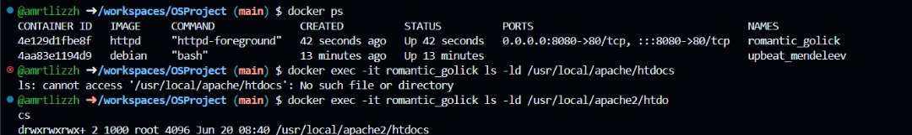

# OSProject Running Containers for Application Development

Group Name: __Linux Runner__. 

Section: __Section 2__. 

Team Mates:
1. __RABIATUL ADAWIYAH BINTI MOHD ALWI__ and __2217808__
2. __SHARIFAH SYAZWINA BINTI SYED SYAMSULHARIS__ and __2214326__
3. __NUR AMIROTUL IZZAH BINTI MOHAMAD FAIZAL__ and __2216966__


***Questions:***

1. What is the link of the fork OSProject in your repository. ***(1 mark)***
<br> __https://github.com/amrtlizzh/OSProject__.
2. How many files and folders are in this repository. ***(1 mark)*** __<br>  __- 1 readme.md file__
 <br>  __- 1 images folder____. <br>  __- 1 nodejs-app folder__. <br>  __- 1 webpage folder__.


## Exploring github codespaces

***Questions:***

1. What is default OS used to run the virtual environment for codespaces. ***(1 mark)***<br> __Ubuntu Linux__.
2. What are the two options of ram, disk and vcpu configuration you can have in running codespaces . ***(1 mark)*** 
<br>  <br> __1. VCPU 2-CORE: RAM = 8GB DISK = 32GB <br> 2. VCPU 4-CORE: RAM = 16GB DISK = 32GB__.
3. Why must we commit and sync our current work on source control? ***(1 mark)*** <br>__To saves changes to local repository, pulls changes from the remote to sync with local changes, and then pushes changes to the remote repository.__.

## Exploring the Terminal

***Questions:***

Look at the TERMINAL tab. Run the following commands and provide the output here. 

1. Run the command **pwd** . ***(1 mark)*** <br> 
2. Run the command **cat /etc/passwd** . ***(1 mark)*** <br> 
3. Run the command **df** . ***(1 mark)*** <br>  
4. Run the command **du** . ***(1 mark)***
<br> 
<br> .
<br> .
<br> .
5. Run the command **ls** . ***(1 mark)***
<br> .
6. Run the command **ls -asl** . ***(1 mark)***
<br> .
7. Run the command **free -h** . ***(1 mark)***
<br> .
8. Run the command **cat /proc/cpuinfo** . ***(1 mark)*** 
<br> .
<br> .
<br> .
<br> 
9. Run the command **top** and type **q** to quit. ***(1 mark)*** <br> .
10. Run the command **uname -a**. ***(1 mark)*** <br> .
11. What is the available free memory in the system. ***(1 mark)*** <br> __```512 Mi```__.
12. What is the available disk space mounted on /workspace. ***(1 mark)*** __```20772316 Mi```__.
13. Name the version and hardware architecture of the linux Virtual environment. ***(1 mark)*** <br> __```Linux codespaces-63a3c6 6.5.0-1021-azure #22~22.04.1-Ubuntu SMP Tue Apr 30 16:08:18 UTC 2024 x86_64 x86_64 x86_64 GNU/Linux```__.
14. What is the difference between **ls** vs **ls -asl**. ***(1 mark)*** <br> __```The ls command lists files and directories in the current directory. The ls -asl command lists all files and directories in the current directory with detailed information, including hidden files, sizes, permissions, and ownership.```__.
15. What is the TLB size of the Virtual CPU. ***(1 mark)*** <br>
__```2560 4K pages.```__.
16. What is the CPU speed of the Virtual CPU. ***(1 mark)*** <br> __```3026.803 ```__.
17. What is the top running process that consumes the most CPU cycles. ***(1 mark)***  <br> __```top - 07:31:45 up  3:26,  0 users,  load average: 0.08, 0.15, 0.16 ```__.

## Running your own container

***Questions:***

1. Are files in the container persistent. Why not?. ***(1 mark)*** <br> __```Files in a container are not persistent because containers are designed to be temporary and easily disposaable. When a container is deleted, its filesystem and any files inside it are also deleted```__.
2. Can we run two, or three instances of debian linux? . ***(1 mark)*** <br> __```Yes, because each container acts like a separate debian linux system, allowing running multiple instances at once```__.

## Running your own container with persistent storage

***Questions:***

1. Check the permission of the files created in myroot, what user and group is the files created in docker container on the host virtual machine? . ***(2 mark)*** <br> __```User: codespace.```__ <br> __```Group: root```__
2. Can you change the permission of the files to user codespace.  You will need this to be able to commit and get points for this question. ***(2 mark)***
```bash
//use sudo and chown
sudo chown -R codespace:codespace myroot

```
<br> __```Yes, the permission of the files to user codespace can be changed, but the directory myroot was not found.```__
<br>
<br> 

## You are on your own, create your own static webpage

***Questions:***

1. What is the permission of folder /usr/local/apache/htdocs and what user and group owns the folder? . ***(2 mark)*** <br> __```User: 1000.```__ <br> __```Group: root```__ <br> 
2. What port is the apache web server running. ***(1 mark)*** <br> __```8080```__.
3. What port is open for http protocol on the host machine? ***(1 mark)*** <br> __```8080```__ <br> .<br> .

## Create SUB Networks

***Questions:***

1. Describe what is busybox and what is command switch **--name** is for? . ***(2 mark)*** <br> __```Busybox: BusyBox is a lightweight, versatile software suite that provides several Unix utilities in a single executable file```__. <br> __```--name: used to assign a custom name to the container```__.
2. Explore the network using the command ```docker network ls```, show the output of your terminal. ***(1 mark)*** <br> .

3. Using ```docker inspect c1``` and ```docker inspect c2``` inscpect the two network. What is the gateway of bluenet and rednet.? ***(1 mark)*** <br> __```Gateway of bluenet: 172.18.0.1```__ <br> __```Gateway of rednet: 172.19.0.1```__.
4. What is the network address for the running container c1 and c2? ***(1 mark)*** <br> __```Network address for c1: 172.18.0.2```__ <br> __```Network address for c2: 172.19.0.2```__.
5. Using the command ```docker exec c1 ping c2```, which basically tries to do a ping from container c1 to c2. Are you able to ping? Show your output . ***(1 mark)*** <br> .


## Bridging two SUB Networks
1. Let's try this again by creating a network to bridge the two containers in the two subnetworks
```
docker network create bridgenet
docker network connect bridgenet c1
docker network connect bridgenet c2
docker exec c1 ping c2
```
***Questions:***

1. Are you able to ping? Show your output . ***(1 mark)*** <br>___```Yes ```___ <br> .

2. What is different from the previous ping in the section above? ***(1 mark)*** <br> <br> __```The difference from the previous ping is that in the successful scenario, both containers are on the same user-defined Docker network, allowing c1 to resolve and communicate with c2, whereas in the error scenario, c1 could not resolve c2 due to being on different networks or lack of proper network configuration```__.

## Intermediate Level (10 marks bonus)

### Summary

You have now set up a Node.js application in a Docker container on nodejsnet netowrk and a MySQL database in another Docker container on mysqlnet network. Now bridge the two network together.

***Questions:***

1. What is the output of step 5 above, explain the error? ***(1 mark)*** <br> <br> ___The output would likely be an error indicating that the Node.js application cannot connect to the MySQL database. This is because the Node.js container and the MySQL container are on separate networks and cannot communicate with each other until they are bridged.___ <br> 
2. Show the instruction needed to make this work. ***(1 mark)*** <br> <br> ___To make the setup work, you need to connect the Node.js container to the mysqlnet network using the following command:___
    ```bash
    docker network connect mysqlnet nodejs-container
    ```


## What to submit

1. Make sure to commit all changes on your source control, and make sure your source control is sync to the repository. 
2. Check your repository link, to see if all the files and answers are included in the repository. 
3. Submit through italeem, by providing the link to your repository.
4. Due by ***AS STATED IN ITALEEM SYSTEM***
